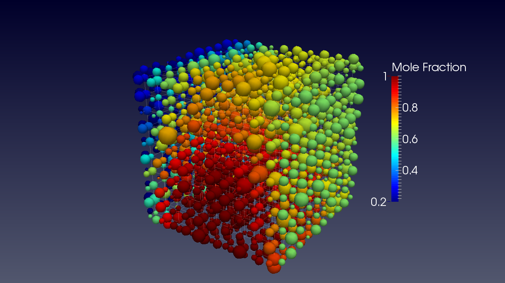
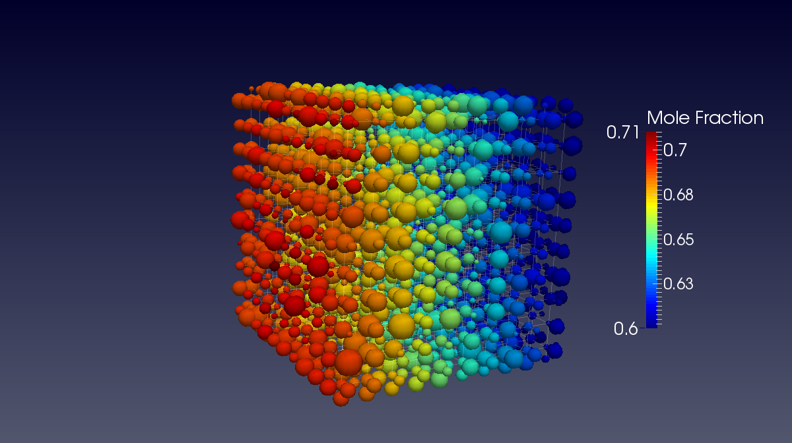

.. _boundary_conditions_example:

===============================================================================
Diffusion Simulations with Various Boundary Conditions
===============================================================================
This example outlines how to perform a variety of transport simulations on pore networks.  It uses the Fickian diffusion algorithm as the basis of the example and demonstrates a number of different boundary conditions specifications.

+++++++++++++++++++++++++++++++++++++++++++++++++++++++++++++++++++++++++++++++
Generating Network, Geometry, Phases and Physics
+++++++++++++++++++++++++++++++++++++++++++++++++++++++++++++++++++++++++++++++
Start by generating a basic cubic network and the other required components:

.. code-block:: python

	import OpenPNM
	pn = OpenPNM.Network.Cubic(name='net',shape=[10,10,10])
	pn.add_boundaries()

In the last call, the method ``add_boundaries()`` is called, which means that a layer of boundary pores around the network is generated. These boundary pores will be used in the following calculations. Next we generate a geometry for the network and the phase, in this case air. A geometry can span over a part of the network only, so we need to specify to which pores and throats this geometry object should apply. For this example, we want it to apply to all pores and throats of the network. To do so, we can get all pore and throat indices of the network with the ``pn.pores()`` and ``pn.throats()`` calls, and pass these to the geometry object.

.. code-block:: python

	Ps = pn.pores()
	Ts = pn.throats()
	geo = OpenPNM.Geometry.Stick_and_Ball(network=pn,name='basic',pores=Ps,throats=Ts)

Next we want to change the pore and throat sizes and throat lengths that were generated by the creation of the ``geo`` object. A change like this requires a regeneration of the geometry object, which is accomplished by calling the ``geo.regenerate()`` method.

.. code-block:: python

	geo['throat.diameter'] = geo['throat.diameter']*1e-5
	geo['pore.diameter'] = geo['pore.diameter']*1e-5
	geo['throat.length'] = geo['throat.length']*1e-5
	geo.regenerate()

Then the phase object is created and a custom value is set.

.. code-block:: python

	air = OpenPNM.Phases.Air(network=pn)
	air['pore.Dac'] = 1e-7  # Add custom properties directly

In the next step, a physics object is instantiated. A physics objects can span over several geometries, so we need to specify again to which pores and throats it should apply. In this case, we want it to apply to all pores and throats of the network. Hence the variables 'Ps' and 'Ts' are again passed during the creation of the physics object.

.. code-block:: python

	phys = OpenPNM.Physics.Standard(network=pn,phase=air,pores=Ps,throats=Ts)

Now we tell the physics object to use the 'bulk_diffusion' of the 'diffusive_conductance' model.

.. code-block:: python

	phys.add_model(model=OpenPNM.Physics.models.diffusive_conductance.bulk_diffusion,
                   propname='throat.gdiff_ac',
                   pore_diffusivity='pore.Dac')

+++++++++++++++++++++++++++++++++++++++++++++++++++++++++++++++++++++++++++++++
Generate an Algorithm Object
+++++++++++++++++++++++++++++++++++++++++++++++++++++++++++++++++++++++++++++++
All algorithms in OpenPNM are independent objects. The Fickian diffusion algorithm is instantiated as follows:

.. code-block:: python

	alg = OpenPNM.Algorithms.FickianDiffusion(network=pn, loglevel=20)

-------------------------------------------------------------------------------
Apply Dirichlet Conditions to Two Faces
-------------------------------------------------------------------------------

Now this algorithm needs to know about the boundary conditions which are to be applied.  Let's start by defining Dirichlet conditions on two opposite faces.  This is done by first finding the pore indices that correspond to the two faces.  The generation of cubic networks automatically adds pores to the network with the label of the different faces.  Let's use the 'top_face' and 'bottom_face' for this and apply Dirichlet boundary conditions to both and apply a numerical value for the boundary conditions:

.. code-block:: python

	BC1_pores = pn.pores(labels=['top_face'])
	alg.set_boundary_conditions(bctype='Dirichlet', bcvalue=0.6, pores=BC1_pores)
	BC2_pores = pn.pores(labels=['bottom_face'])
	alg.set_boundary_conditions(bctype='Dirichlet', bcvalue=0.4, pores=BC2_pores)

The above code adds the Dirichlet boundary conditions to both the pores at the 'top_face' and the 'bottom_face'.  The Fickian algorithm looks for this specific label when analyzing and setting up the problem.  Note that the the above code uses the *setter* method associated with the Algorithm object, not the pore network object.  This means that the pore labels will only be applied to this specific algorithm. This is designed to allow multiple algorithms to exist simultaneously without interfering with each other.

Note again that the *setter* method of the algorithm was used to keep these boundary conditions isolated from other algorithms. Once the boundary conditions are specified, the algorithm can be run quite simply as:

.. code-block:: python

	alg.run(conductance='throat.diffusive_conductance',phase=air)

This runs the algorithm using 'throat.diffusive_conductance' as the model for conductance and air as the phase. The results are then stored on the Algorithm object.  This is done to prevent simultaneous objects from interfering with each other.  If and when the results of an Algorithm are required by the network model they must be explicitly sent *out* using:

.. code-block:: python

	alg.update_results()

Each Algorithm must subclass the `update_results()` method so that it sends the correct information out the network and/or phase.  In the case of the Fickian Algorithm, the 'mole_fraction' of the active_phase is stored on the Phases object in question.  Running a different version of the Algorithm and calling `update()` will overwrite any previous values.  The results of this simulation should produce the following visualization (done in Paraview):

.. image:: BC1.png

-------------------------------------------------------------------------------
Apply Neumann Conditions to a Group of Internal Pores
-------------------------------------------------------------------------------

The code below sets the total rate leaving a group of pores cumulatively.  Note that the same Algorithm object is used (`alg`), so the Dirichlet boundary conditions applied in the previous step still exist.  The lines below define a group of 10 pores which are generating mass at a set rate, which is accomplished by creating a 'Neumann_group' boundary condition and placing the numerical value of the rate in 'bcvalue'.

.. code-block:: python

	BC3_pores = [50,51,52,53,54,40,41,42,43,44]
	alg.set_boundary_conditions(bctype='Neumann_group', bcvalue=-5e-3, pores=BC3_pores)
	alg.run(conductance='throat.diffusive_conductance',phase=air)
	alg.update_results()

This results in the image below, where a region of high concentration can be seen in the core of the domain due to the mass production:

-------------------------------------------------------------------------------
Apply Neumann Conditions in Several Pores Individually
-------------------------------------------------------------------------------

One of the options for specifying Neumann conditions is to apply the same rate to multiple pores.  Begin by removing some of the conditions applied above, then set a few pores on the 'bottom' face to each have the same specific rate.

.. code-block:: python

	alg.set_boundary_conditions(bctype='Neumann_group', pores=BC3_pores, mode='remove') # This removes label from pores
	alg.set_boundary_conditions(bctype='Dirichlet',pores=BC2_pores, mode='remove')
	alg.set_boundary_conditions(bctype='Neumann',pores=BC2_pores, bcvalue=1e-10)
	alg.run(conductance='throat.diffusive_conductance',phase=air)
	alg.update_results()

This results in image below.  Notice that the concentration on the inlet face is not uniform, and that the smaller pores have a somewhat higher concentration (darker red), which is necessary if their flux is the be the same as larger, more conductive pores.

