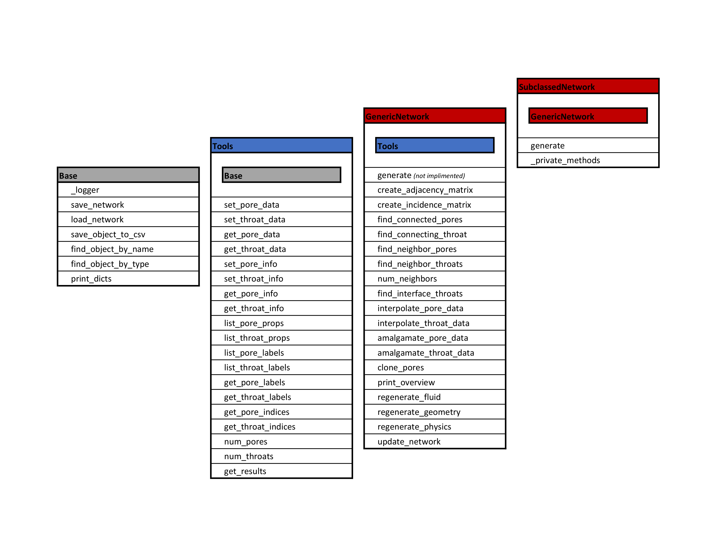

.. _network:

###############################################################################
The Network Object
###############################################################################

The **Network** is the central object in OpenPNM.  In any simulation there will only be one network object.  This object is the *controller* and *coordinator* of the other objects.  For instance, each of the other objects (Phases, Geometries, and Physics) register themselves with the network so the network knows of their existence.  

1.  **Query methods** which use the topology of the network.  For instance, for finding the neighbor pores connected to a given pore or set of pores

2.  **Adjacency and Incidence Matrices**:  These matrices are stored on the network object as Scipy sparse arrays. They can be created using the ``create_adjacency`` or ``create_indicidence`` methods.  They can be accessed directly for use in algorithms as needed (as in ordinary percolation).  Some of the *query* type methods access these matrices to find connected throats and neighbors.  

3.  **Data Storage**:  All of the data pertaining to topology and geometry are stored on the Network object under ``_pore_data`` and ``_throat_data``.  These dictionaries are filled with Numpy ndarrays, each stored under a descriptive *key* such as 'diameter' or 'volume'.  These arrays should not be accessed directly however.  The **Network** inherits the *setter* and *getter* methods from **Tools**, so these should be used.

   The inheritance diagram for a Network object, showing inheritance from Base and Tools, as well as the subclassing of specific topologies from GenericGeometry.