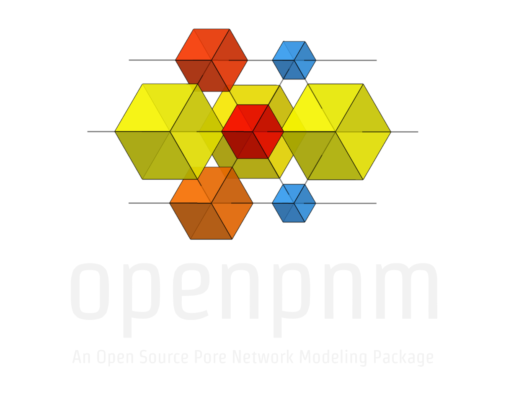

## OpenPNM: Gallery of Examples

This page links to examples in the Github repo at [github.com/PMEAL/OpenPNM/examples/notebooks](https://www.github.com/PMEAL/OpenPNM/examples/notebooks)

[//]: # (This line and the one below are not rendered in the final file, so basically act as comments)
[//]: # (It's possible to insert images into the cells using  )

### [Tutorials](/examples/notebooks/tutorials)

| Link | Description |
|:-----|:------------|
| [Tutorial 1 - Basic](/examples/tutorials/intro_to_openpnm_basic.ipynb) | An overview of OpenPNM in terms of basic manual calculations |
| [Tutorial 2 - Intermediate](/examples/tutorials/intro_to_openpnm_intermediate.ipynb) | A repeat of Tutorial 1, but using the features of OpenPNM correctly |
| [Concise but Detailed Overview](/examples/tutorials/concise_overview_of_openpnm.ipynb)  | This notebook goes over most of the key aspects OpenPNM with minimal description, favoring links to other relevant notebooks and resources instead for further reading |
| [Storage of Network Data and Topology](/examples/tutorials/data_and_topology_storage.ipynb) | Provides a explanation of how numerical data is stored in OpenPNM, including the storage of the topological information using sparse adjacency matrices |
| [Querying the Topology to Find Neighbors](/examples/tutorials/finding_neighbor_pores_and_throats.ipynb) | Illustrates how to find neighboring pores and throats using topological and spatial information |
| [Using and Creating Labels](/examples/notebooks/using_and_creating_labels.ipynb) | Labels are used to mark pores and throats for easier selection elsewhere in the simulation, such as applying boundary conditions.  This tutorial illustrates how to use the labels that are automatically included on generated networks and how to add new user-defined labels. |
| [Defining Multiple Subdomains](/examples/tutorials/defining_multiple_subdomains.ipynb) | One of the "power" features of OpenPNM is the ability to define multiple subdomains, enabling the simulation of layered or hierarchical materials with different pore sizes.  This tutorial provides an explanation of this feature. |
| [The Workspace and Projects](/examples/tutorials/overview_of_workspace_and_projects.ipynb) | OpenPNM simulations called Projects and several Projects can be open within a single Workspace.  This tutorial illustrates the relationship between these to constructs and their features. |

### [Network](/examples/notebooks/networks)

#### [Generation](/examples/notebooks/networks/generation)

| Link | Description |
|:-----|:------------|
| [Cubic Lattice](/examples/notebooks/networks/generation/cubic_networks.ipynb) | The Cubic lattice is the classic pore network topology, and provides an excellent starting point for any investigation.  The ability to alter the coordination number up to 26, combined with deleting random pores and throats creates an even more realistic topology. |
| [Dual Cubic Lattice](/examples/notebooks/networks/generation/dual_cubic_lattices.ipynb) | The simultaneous simulation of transport in the void and solid, and their interactions, can be done with two interpenetrating cubic networks as illustrated in this tutorial |
| [Cubic Template](/examples/notebooks/networks/generation/cubic_templates.ipynb) | Cubic lattices do not have to be constrained to cubic shaped domains.  This tutorial explains how arbitrary shaped domains (e.g. a spherical particle) can be created, though note the networks would still have a cubic lattice connectivity. |
| [Delaunay and Voronoi Tessellation](/examples/notebooks/networks/generation/random_networks_based_on_delaunay_and_voronoi_tessellations.ipynb) | If truly random topology is necessary then this can be accomplished by performing a Delaunay tessellation on randomly (or not so randomly) distributed points |

#### [Manipulation](/examples/notebooks/networks/manipulation)

| Link | Description |
|:-----|:------------|
| [Adding Boundary Pores](/examples/notebooks/networks/manipulation/adding_boundary_pores.ipynb) | Boundary pores are useful when conducting transport simulations, but they are not added to generated OpenPNM network automatically.  This tutorial explains their importance as well as how to add them to the network. |
| [Manually Adding and Removing Pores and Throats](/examples/notebooks/networks/manipulation/manually_adding_pores_and_throats.ipynb) | It's possible to alter a pore network by manually adding/removing pores and/or throats.  This tutorial describes the available tools in OpenPNM and explains what occurs behind the scenes. |
| [Stitching and Merging Networks](/examples/notebooks/networks/manipulation/stitching_and_merging_networks_together.ipynb) | Given two or more networks, it is necessary to somehow join them into a single domain to perform simulations.  This tutorial explains the difference between merging and stitching, and gives some examples on how to do both. |
| [Joining Pore Network and Continuum Domains](/examples/notebooks/networks/manipulation/coupling_continuum_regions_with_pore_networks.ipynb) | This is a variation on stitching networks together, where one has much smaller spacing than the other |

#### [Extraction](/examples/notebooks/networks/extraction)

| Link | Description |
|:-----|:------------|
| [Benthiemer ICL Benchmark](/examples/notebooks/networks/extraction/benthiemer_ICL_benchmark.ipynb) | This example is one of the benchmark examples to illustrate the capability of OpenPNM for fast and accurate prediction of permeability.  A network model for Benthiemer rock sample were extracted using PoreSpy. Permeability and of the network and effective diffusivity of air was then calculated implementing Stokes flow and Fickian diffusion in OpenPNM. Methods for calculation of permeability and diffusivity (effective properties) are included in generic transports in OpenPNM. |
| [Doddington ICL Benchmark](/examples/notebooks/networks/extraction/doddington_ICL_benchmark.ipynb) | This example is a benchmark example to calculate the permeability of a Doddignton rock sample. The extracted network is loaded in OpenPNM for implementing Stokes flow. |
| [Berea ICL Benchmark](/examples/notebooks/networks/extraction/berea_ICL_benchmark.ipynb) | This example is a benchmark example to calculate the permeability of a Berea rock sample. The extracted network is loaded in OpenPNM for implementing Stokes flow and Fickian diffusion for effective properties calculation. |
| [Predicting Permeability of Berea](/examples/notebooks/networks/extraction/predicting_effective_permeability_of_berea.ipynb) | This example is a benchmark example to illustrate the steps towards calculation of permeability for a Berea rock sample. This example includes the network extraction procedure in PoreSpy as well. OpenPNM was then used to find the permeability of the network. |
| [Working with Extracted Networks](/examples/notebooks/networks/extraction/working_with_extracted_networks.ipynb) |This example illustrates the the steps for extracting networks from synthetic image of porous medium. Network extractions on digital porous media images can be implemented in PoreSpy open source package. PoreSpy output is consistent with OpenPNM input modules. The extracted network can then be easily used for other purposes in OpenPNM. |

### [Geometry](/examples/notebooks/geometry)

| Link | Description |
|:-----|:------------|
| [Basic Stick and Ball](/examples/notebooks/geometry/stick_and_ball.ipynb) | The StickAndBall contains the standard pore-scale models to describe the geometry of a pore network. |
| [Defining Continuum Regions](/examples/notebooks/geometry/defining_continuum_regions.ipynb) | `in progress` |
| [Overview of Shape Factors](/examples/notebooks/geometry/overview_of_shape_factors.ipynb) | `in progress` |
| [Adjusting Pore Size Distributions](/examples/notebooks/geometry/adjusting_pore_size_distributions.ipynb) | The basic StickAndBall class is a good place to start since it has all the necessary pore-scale models, but to customize it for a specific material requires adjusting the pore and throat size distribution.  This example illustrates how to change the pore-size distribution function and how to tweak the distributions parameters to get a suitable result. |

### [Materials](/examples/notebooks/materials)

| Link | Description |
|:-----|:------------|
| [Fibrous Media with Voronoi Tessellations](/examples/notebooks/materials/fibrous_media_based_on_voronoi_tessellation.ipynb) | The Voronoi tessellation has been successfully used to model transport in fibrous media in several papers.  This class generates a VoronoiDelaunay network object, then further creates a geometry object containing all the associated geometrical models. |

### [Thermophysical Properties](/examples/notebooks/phases)

| Link | Description |
|:-----|:------------|
| [Creating a Custom Phase](/examples/notebooks/phases/creating_a_custom_phase.ipynb) | OpenPNM includes only a few common phases as predefined classes, but it is quite easy to create new phases with custom properties.  This example illustrates how to leverage the library of generic pore-scale models to create phases for any application. |
| [Working with Mixtures](/examples/notebooks/phases/working_with_mixtures.ipynb) | `in progress` |

### [Simulations](/examples/notebooks/algorithms)

#### [Percolation](/examples/notebooks/algorithms/percolation)

| Link | Description |
|:-----|:------------|
| [Ordinary Percolation](/examples/notebooks/algorithms/percolation/A_ordinary_percolation.ipynb) | Ordinary percolation corresponds to pressure-based invasion of non-wetting fluid.  The OrdinaryPercolation class is the basis for simulating mercury intrusion and other capillary pressure curve measurements.  This example illustrates its general use. |
| [Invasion Percolation](/examples/notebooks/algorithms/percolation/B_invasion_percolation.ipynb) | Invasion percolation corresponds to the to volume-based injection of a non-wetting phase.  InvasionPercolation is the preferred approach for estimating multiphase transport properties since all saturations can be obtained, unlike OrdinaryPercolation which only produces saturations at discrete applied pressure steps. |
| [Mixed Invasion Percolation](/examples/notebooks/algorithms/percolation/C_mixed_invasion_percolation.ipynb) | Mixed invasion percolation is used for simulating imbibition of a wetting fluid.  The *mixed* aspect refers to the fact that both pore bodies and throats are considered during the invasion. |
| [Meniscus Model Comparison](/examples/notebooks/algorithms/percolation/D_meniscus_model_comparison.ipynb) | More elaborate meniscus models beyond the standard cylindrical tube are discussed in this example. |
| [Mercury Intrusion Porosimetry](/examples/notebooks/algorithms/percolation/capillary_pressure_curves.ipynb) | The IntrusionPorosimetry class is a subclass of OrdinaryPercolation which is specifically developed for simulating capillary drainage of a non-wetting fluid.  This class illustrates how to compare simulation to experimental data. |

#### [Single Phase Transport](/examples/notebooks/algorithms/single_phase)

| Link | Description |
|:-----|:------------|
| [Basic Fickian Diffusion, Tortuosity, and Formation Factor](/examples/notebooks/algorithms/single_phase/fickian_diffusion_and_tortuosity.ipynb) | Calculating the rate of diffusion through a network is a primary use of OpenPNM, and this example illustrates how to do it, and how to convert the result into known transport parameters such as tortuosity and formation factor. |
| [Diffusion with Concentration Dependent Diffusivity](/examples/notebooks/algorithms/single_phase/diffusion_with_concentration_dependent_diffusivity.ipynb) | This example illustrates how to define a costum diffusivity model and assign to the phase object. A Fickian diffusion on a cubic network with a variable diffusivity is implemented. |
| [Permeability Tensor](/examples/notebooks/algorithms/single_phase/stokes_flow_and_permeability_tensor.ipynb) | The direct connection between the structure on the transport is one of main benefits of pore networks.  This examples uses a 2-layered network with 3x smaller pores in on layer to illustrate how the permeability coefficient for each direction can be determined. |
| [Deep Dive into Conductance Models](/examples/notebooks/algorithms/single_phase/deep_dive_into_conductance_models.ipynb) | `in progress` |

#### [Multiphase Transport](/examples/notebooks/algorithms/multiphase)

| Link | Description |
|:-----|:------------|
| [Relative Diffusivity](/examples/notebooks/algorithms/multiphase/relative_diffusivity.ipynb) | OpenPNM supports different multiphase transport phenomena. This example shows the procedures for calculation of relative diffusivity of Air and Water phases in a cubic network. For a multiphase diffusive mass transport problem invasion and distribution of phases can be modeled with percolation algorithms. Relative diffusivity of phases can then be calculated implementing Fickian diffusion for each phase considering multiphase pore scale models. |
| [Relative Permeability in 2D](/examples/notebooks/algorithms/multiphase/relative_permeability_2D.ipynb) | OpenPNM is capable of simulating multiphase transport mechanisms such as drainage and imbibition in porous media. Relative properties of phases can be calculated assigning a related pore scale model and transport algorithm. This example presents the calculation procedures for relative permeability of Air and Water phases for a 2D network. Calculations for 3D networks follow the same steps. |
| [Relative Permeability Metrics](/examples/notebooks/algorithms/multiphase/relative_permeability_metrics.ipynb) | This example illustrates the steps to use the metrics algorithm to find the relative permeability of a cubic network. The calculation of the relative permeability for an arbitrary network is automated in the metrics relative permeability algorithm. |

#### [Reactive Transport](/examples/notebooks/algorithms/reactive)

| Link | Description |
|:-----|:------------|
| [Diffusion with Source and Sink Terms](/examples/notebooks/algorithms/reactive/diffusion_with_source_and_sink_terms.ipynb) | OpenPNM is capable of simulating chemical reactions in pores by adding source and sink terms. This example shows how to add source and sink terms to a steady state fickian diffusion simulation. |
| [Heat Transfer with Source Terms](/examples/notebooks/algorithms/reactive/one_dimensional_continuum_heat_transfer_with_source_term.ipynb) | `Done` |

#### [Multiphysics](/examples/notebooks/algorithms/multiphysics)

| Link | Description |
|:-----|:------------|
| [Advection-Diffusion](/examples/notebooks/algorithms/multiphysics/advection_diffusion.ipynb) | `in progress` |
| [Nernst-Planck-Poisson](/examples/notebooks/algorithms/multiphysics/nernst_planck_poisson.ipynb) | `in progress` |

#### [Transient Transport](/examples/notebooks/algorithms/transient)

| Link | Description |
|:-----|:------------|
| [Transient Fickian Diffusion](/examples/notebooks/algorithms/transient/transient_fickian_diffusion.ipynb) | The package OpenPNM allows for the simulation of many transport phenomena in porous media such as Stokes flow, Fickian diffusion, advection-diffusion, transport of charged species, etc. Transient and steady-state simulations are both supported. An example of a transient Fickian diffusion simulation through a Cubic pore network is shown here. |
| [Transient Fickian Diffusion with Reaction](/examples/notebooks/algorithms/transient/transient_fickian_diffusion_with_reaction.ipynb) | OpenPNM supports adding reaction terms to both steady state and transient simulations. OpenPNM already includes many different source term models that can be added to simulate a reaction. In this example, we show how to add a powerlaw source term model to a transient fickian diffusion simulation. |
| [Transient Advection-Diffusion](/examples/notebooks/algorithms/transient/transient_advection_diffusion.ipynb) | Transient advection-diffusion simulations can be used to model elution curves.  This example shows how to fit the concentration profile at the outlet to determine the dispersion coefficient of a network. |

#### [General Info](/examples/notebooks/algorithms/general)

| Link | Description |
|:-----|:------------|
| [Understanding Basic Solver Settings](/examples/notebooks/algorithms/general/understanding_basic_transport_settings.ipynb) | `in progress` |
| [Understanding Reactive Solver Settings](/examples/notebooks/algorithms/general/understanding_reactive_transport_settings.ipynb) | `in progress` |
| [Understanding Transient Solver Settings](/examples/notebooks/algorithms/general/understanding_transient_transport_settings.ipynb) | `in progress` |
| [Comparison of Available Matrix Solvers](/examples/notebooks/algorithms/general/available_matrix_solvers.ipynb) | `in progress` |
| [Overview of Algorithm Inheritance](/examples/notebooks/algorithms/general/overview_of_inheritance.ipynb) | `in progress` |
| [Issue with Domain Area and Length](/examples/notebooks/algorithms/general/the_problem_with_domain_length_and_area) | Automatically determining the length and area of a domain is more difficult that it seems, as illustrated in this notebook. |

### [Import, Export and Visualization](/examples/notebooks/io)

| Link | Description |
|:-----|:------------|
| [Quick Plotting Networks](/examples/notebooks/io/quick_plotting_networks.ipynb) | There are several functions built into OpenPNM for generating quick and dirty plots of network topology.  These are useful for ensuring topological manipulations are working as expected, for example. |
| [Rendering in Paraview](/examples/notebooks/io/rendering_in_paraview.ipynb) | Paraview is the recommended visualization software to use in conjuction with OpenPNM. This example is still `in progress` |
| [Loading a Statoil File and Calculating K](/examples/notebooks/io/loading_statoil_finding_permeability.ipynb) | The Statoil format is used by the group at Imperial College, who have pioneered the principle of sharing code.  Their maximal ball network extraction code outputs 4 files, which can be imported into OpenPNM, as outlined in this example. |
